# 二. Vite 的相关配置

为了方便起见，我们在 package.json 文件里新加一些额外的选项，让项目启动和预览时自动打开浏览器，并将开发环境更改为 start

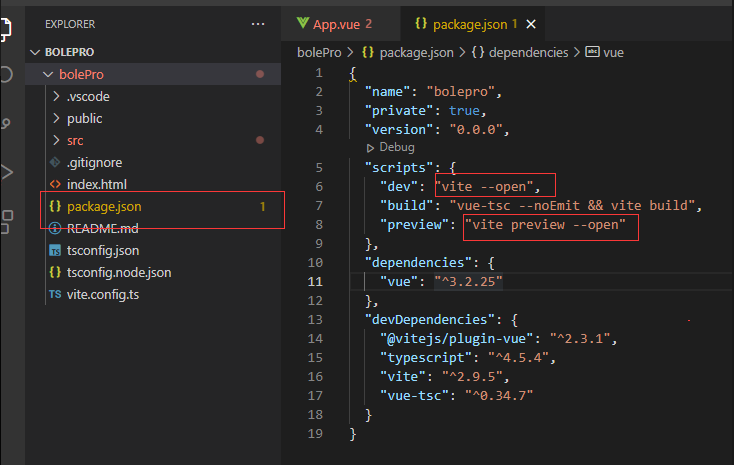

然后在进入项目目录后安装依赖并启动，运行 yarn & yarn start , 启动之后由于添加了--open ，浏览器自动打开

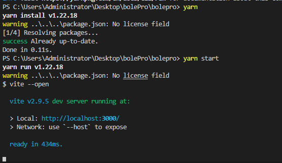

## 2.1 修改 base 基础路径

首先我们应该去关注项目的基础路径，先打开项目看一下图片资源的地址

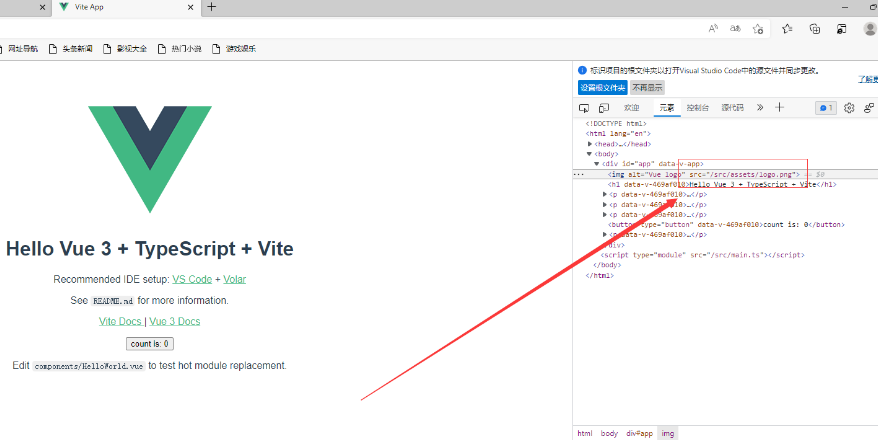

可以看到目前在开发环境下基础路径是/ ，但由于在服务器上，比如 linux 服务器上，根路径可能是 root ，应该修改为相对路径，打开 vite.config.ts , 添加 base

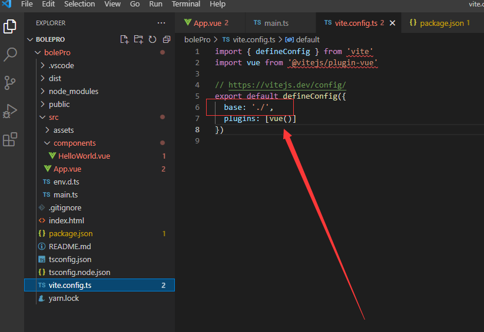

之后运行打包命令并且预览 yarn build & yarn preview ，看一下是否配置成功


可以看到打包后预览中图片的路径已经变成./ ，说明 base 基础路径配置成功

## 2.2 配置常用的别名

项目中有很多公用的路径，比如 component assets public ，这些常用的路径可以直接配置为别名，方便开发

我们要使用到 node 的路径功能，需要让他支持一下 ts

由于 path 是 node 的功能，我们需要下载一下 node 的 types 文件，这个东西其实就是.d.ts ，里面写了一些关于 node 方法的声明

```
npm install @types/node --save-dev
```

安装完成之后重启即可

在 vite.config.ts 中添加四个别名`comp public assets` ，分别对应项目中的`component public assets` 三个路径

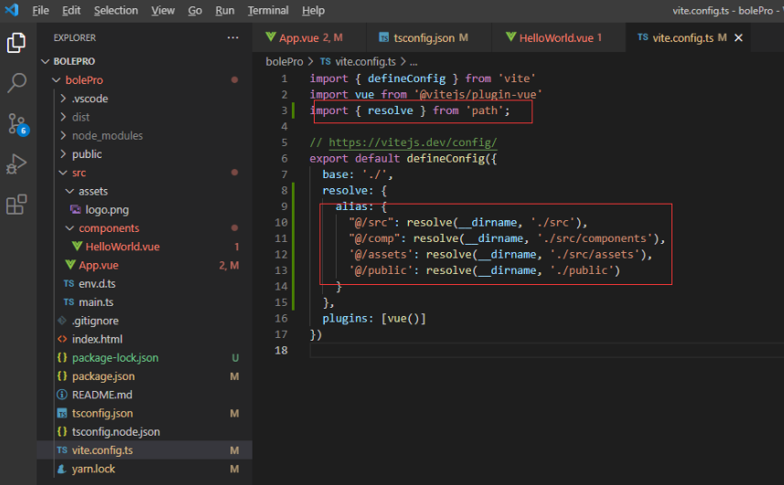

注意这里如果是要引用静态资源的话必须以/ 开头

接下来修改`helloword` 组件/的引入方式，看看配置成功了没有。将`./components` `修改为comp` ,同时把`img` 的引用路径从`./assets` 修改为`/assets`

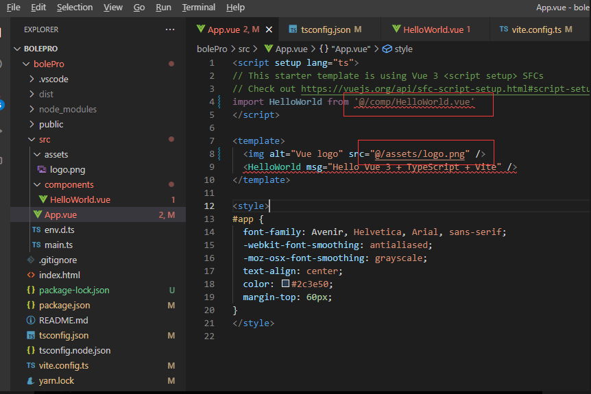

再打开页面看看，一切正常，说明配置`alias`成功

## 2.3 配置 ts 别名和 volar 插件

可以看到这里报了`ts` 和`vetur` 的错误

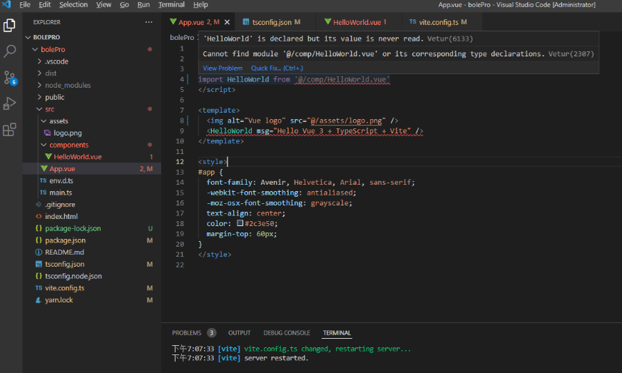


我们在 ts 中也加入类型别名的配置

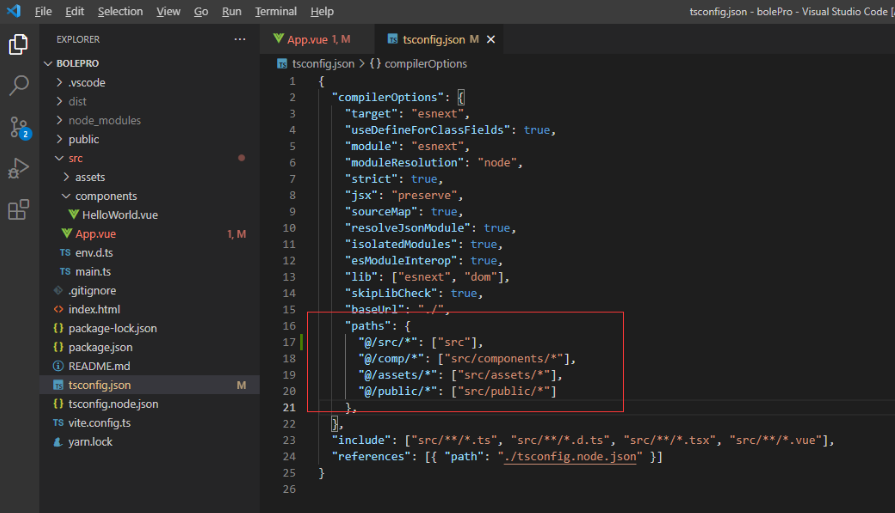

看到剩下一个`vetur` 的报错

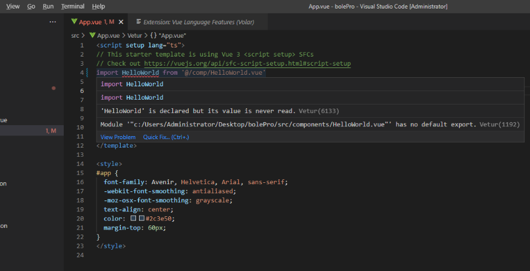

在`vetur` 官方`issue` 中找到这么一段描述：

If you take a look at how Evan recently responded about the recommended approach going forward, it seems that volar is currently the extension of choice for vue 3.

官方推荐下载 volar 来代替 vetur ，简单来说 volar 就是 vetur 的升级版，之后重启 vscode ,所有 ts 和 vetur 类型报错全部解决。

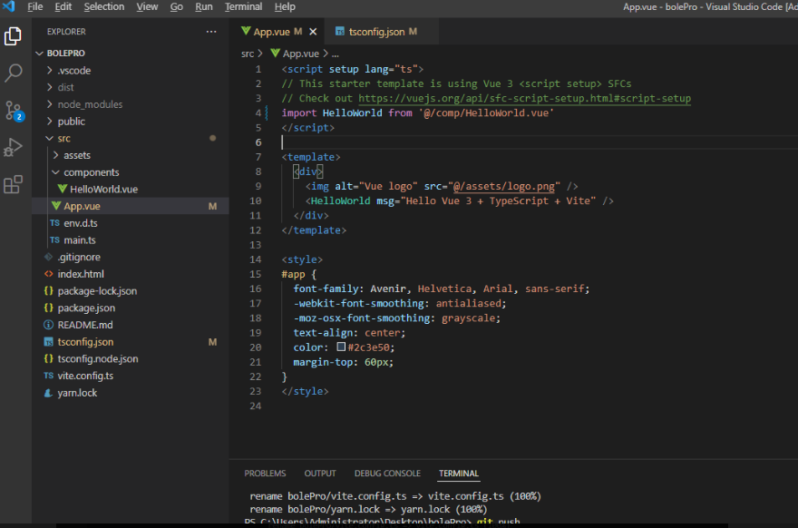

## 2.4 打包目录优化

我们先将现在的项目打包一下试试看，运行`yarn build` 命令

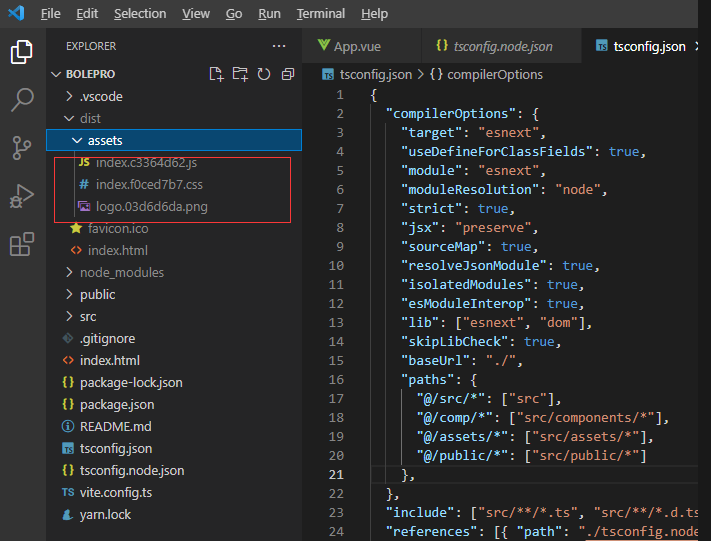

这里可以看到资源全部被打包到了`assets` 下面，如果熟悉组件库或者脚手架打包产物的应该会知道 css js 和各种图片类型都应该分包去处理，我们在 vite 下可以做一下简单的配置

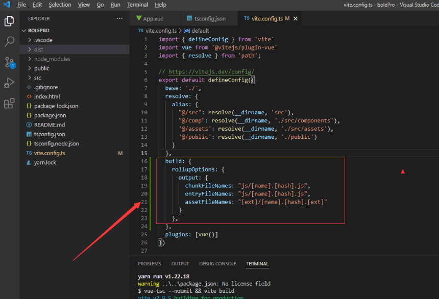

这里对入口文件，打包文件，静态资源文件都做了配置，

其他详情配置可以参考 rollup 文档：https://rollupjs.org/guide/en/#outputchunkfilenames

然后再运行一下 yarn build 试试

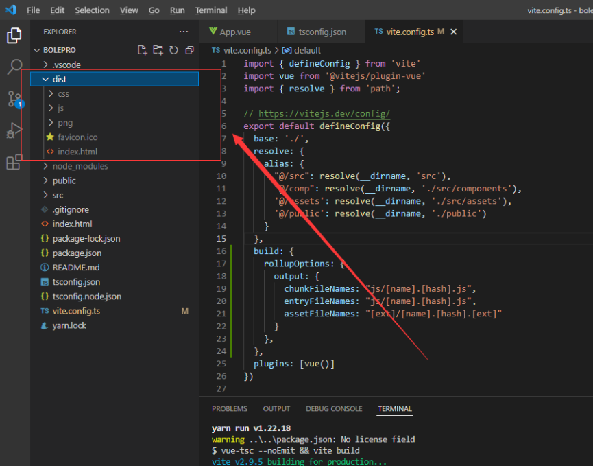

可以看到已经按我们想要的效果打包成功了。

## 2.5 清除无用的 console.log

平常开发中会经常用到 console.log 来进行调试，但这部分代码在生产环境可能造成一些隐患，并且额外增加了打包文件的大小，我们需要清除一下，只需要指定 terser 和 compress 选项即可，但这里需要注意一下如果指定压缩器为 terser ，效率是要比默认的 Esbuild 慢一些的，如果追求极速打包可以不配置

---

用来指定使用哪种混淆器。默认为  Esbuild，它比 terser 快 20-40 倍，压缩率只差 1%-2%。
--Benchmarks

---

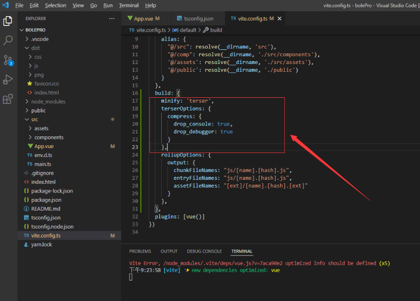

我们在代码里添加一下 console.log 测试一下

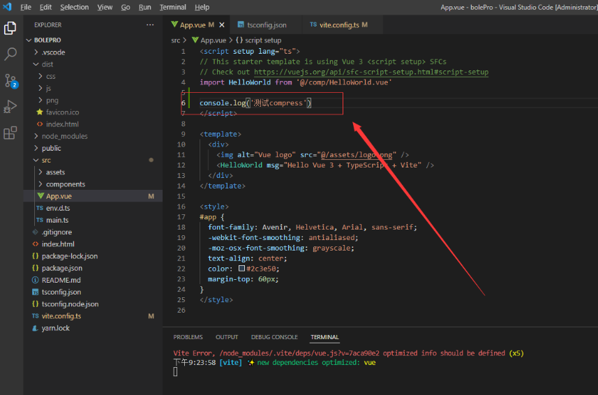

然后执行`yarn build & yarn preview` 查看一下线上环境是否成功

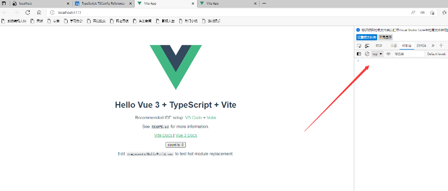

线上环境无 console.log ，配置成功。

## 2.6 配置 Proxy

由于浏览器存在跨域问题，我们需要使用 node-proxy 来解决跨域访问问题，在 vite.config.ts 中进行配置


接下来在代码中使用 Axios 进行访问尝试

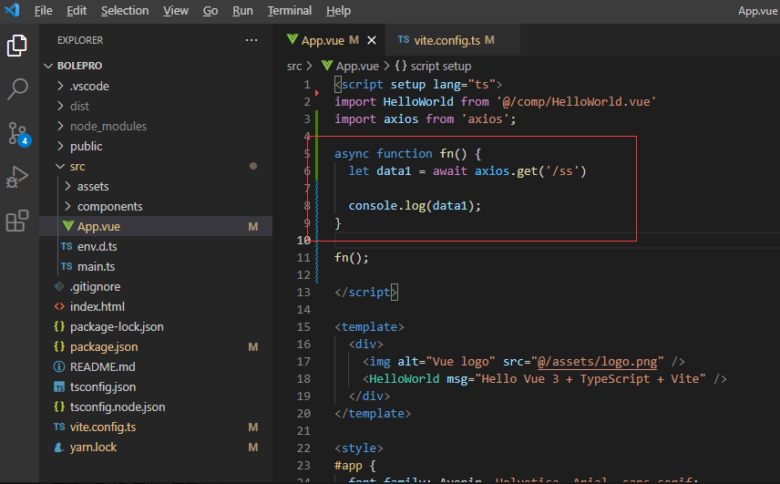

页面数据获取正常，配置完成

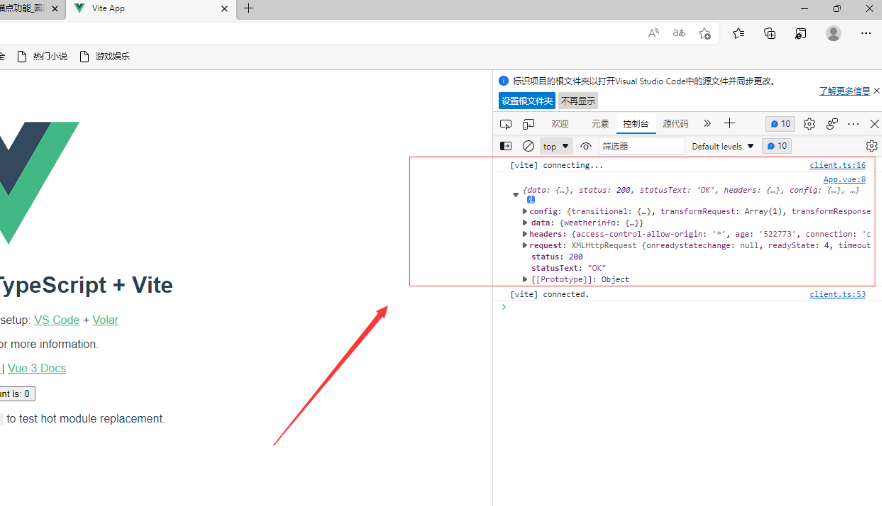

## 2.7 mock 数据配置

项目中经常会使用到 mock 数据的功能

```
yarn add mockjs

yarn add vite-plugin-mock -D
```

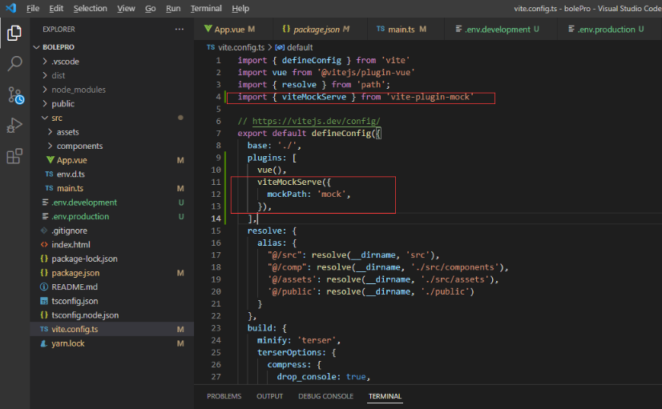

接下来在文件中使用 Axios 请求./api/get ，数据 mock 成功

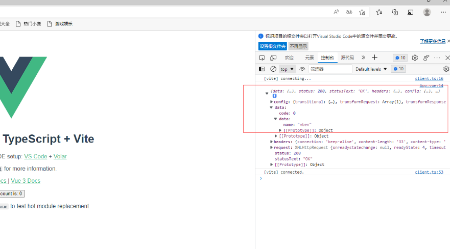

## 2.8 env 和 dep

请求接口处需要集成开发环境变量 和生产环境 的接口变量

新建`.env.production` 和`.env.development` 俩个文件

添加上自己想要的变量，比如本地是 mock 地址，线上是服务器地址

```
.env.development:
    VITE_BASE_URL=/api/get

.env.production:
    VITE_BASE_URL=/apiPro
```

本地我们使用./api/get ，线上时我们使用线上环境的服务器地址，所以应该将/apiPro 映射到服务器地址，在 Proxy 中进行配置

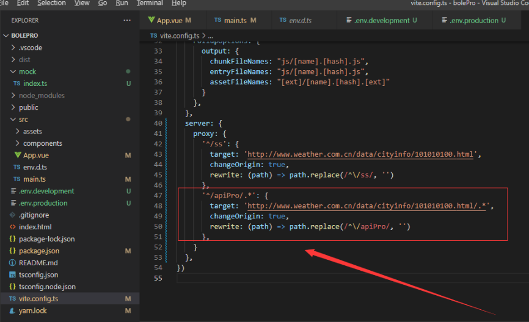

线上使用的 env 都是/apiPro ，在 Proxy 中帮我们映射到服务器的真实地址

接下来我们可以通过 import.meta.env.VITE_BASE_URL 访问./api/get ，线上时会自动替换为服务器地址

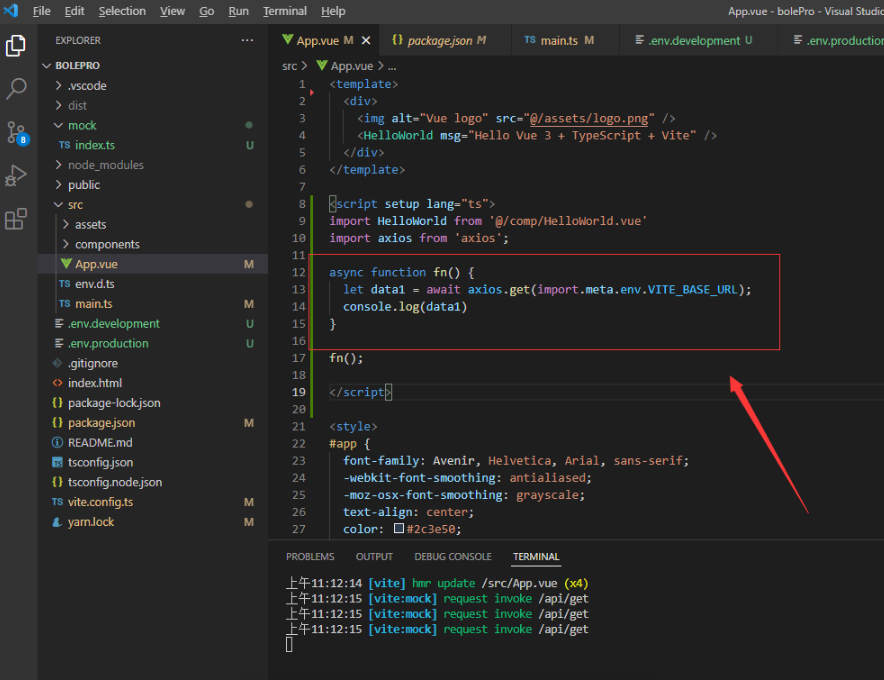

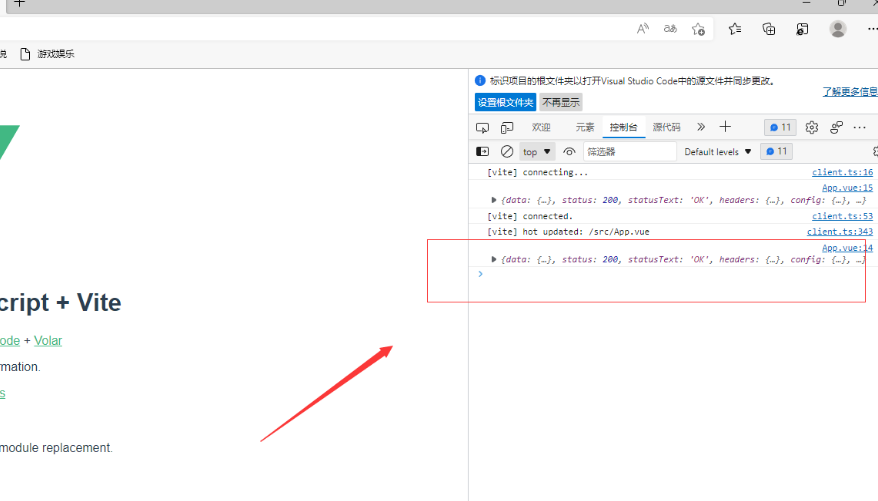

## 2.9 静态资源图片处理

先在 assets 目录下新建一个 img 的文件夹，放入一个体积比较大的图片来进行测试，当前图片是 411kb，已经算是挺大了

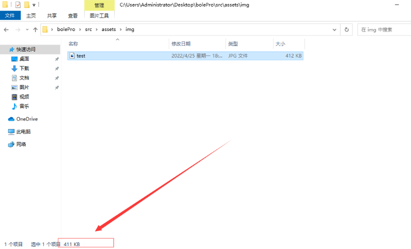

运行一次打包命令看看


可以看到当前图片很大并且并没有被处理

使用`vite-plugin-imagemin`这个插件对图片进行处理

```
yarn add vite-plugin-imagemin -D
```

然后再 vite.config.ts 中的 plugin 引入并添加配置

    viteImagemin({
      gifsicle: {
        optimizationLevel: 7,
        interlaced: false,
      },
      optipng: {
        optimizationLevel: 7,
      },
      mozjpeg: {
        quality: 20,
      },
      pngquant: {
        quality: [0.8, 0.9],
        speed: 4,
      },
      svgo: {
        plugins: [
          {
            name: "removeViewBox",
          },
          {
            name: "removeEmptyAttrs",
            active: false,
          },
        ],
      },
    }),

这里的每一个参数 都对应一个 github 压缩库，分别处理不同类型的文件

接下来再打包试试看


图片从 411kb 压缩到了 14kb，效果还是很显著的

## 2.10 开启 gzip 代码压缩

下载插件 vite-plugin-compression

```
yarn add vite-plugin-compression -D
```

再 plugin 中添加下面的配置

    viteCompression({
      //打包的是gzip,如果后端也开启gzip资源，浏览器会直接走gzip资源，提高传输效率
      verbose: true,
      disable: false,
      //大于10240b才压缩
      threshold: 10240,
      algorithm: "gzip",
      ext: ".gz",
    }),

然后尝试 build，可以看到在下面打包出来了 gzip 的资源


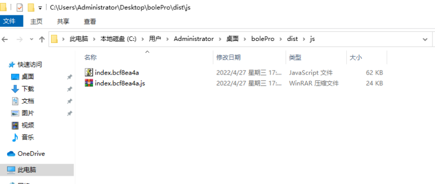

这时候如果后端同时开启了 Gzip 压缩，那么浏览器会直接走 Gzip 包，提高传输效率
